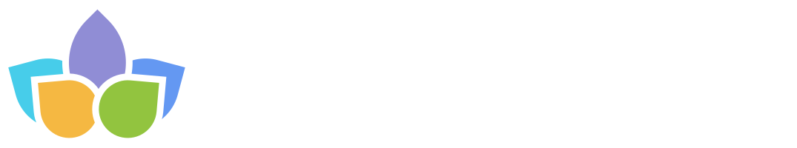
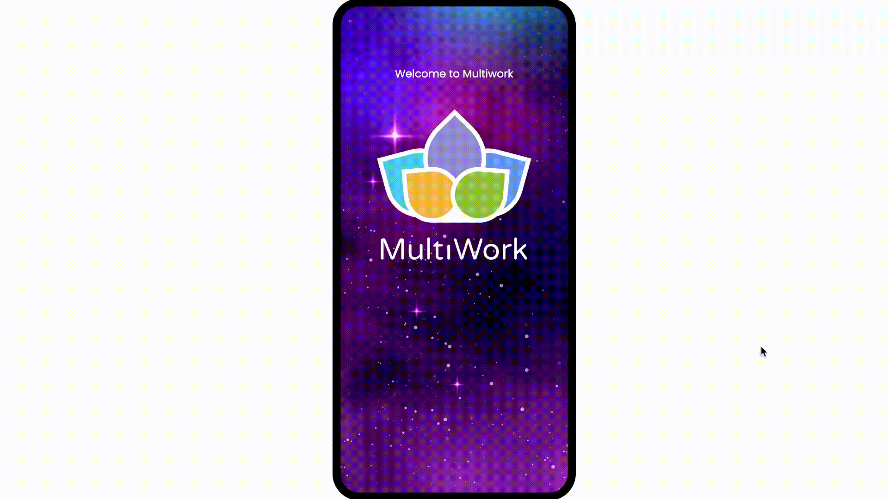

  
  <h1>MultiWork</h1>
  
<strong>Collaboration Platform for Developers & Startups</strong>

  
  
  
  
  

   
  
  

   
   

  

    <b>Build real projects. Work in teams. Launch startups.</b> 
    MultiWork connects early-career developers and professionals to build MVP products together, 
    gain real-world experience, and boost portfolios for accelerators and Global Talent Visas.
  

---

## 🚀 Overview

**MultiWork** (formerly winmultiwork) is a platform designed to solve the "catch-22" of hiring: you need experience to get a job, but a job to get experience. We help users:
*   **Create & Join Projects**: Assemble cross-functional teams (Dev, Design, Product).
*   **Build MVPs Rapidly**: Focus on "shipping quickly" using AI tools and receiving real user feedback.
*   **Career Growth**: Use these live projects for **Global Talent Visa** applications, hackathons, and startup accelerators.

## 🛠 Technical Stack

| Component | Tech Stack | Key Features |
| :--- | :--- | :--- |
| **Backend** |   | Spring Security, PostgreSQL, OAuth2, REST API |
| **Frontend** |   | Responsive Design, Custom Components, React Router |
| **Mobile** |  | **Push Notifications** (Critical for retention), Project mgmt |
| **Infra** |  | EC2, CodeDeploy, S3 (Planned), RDS (Planned) |

## 🌟 Key Features

*   **User Profiles**: Showcase skills, social links, and portfolio.
*   **Project Market**: Create projects, recruit members, and find teams.
*   **Socialization**: Comments, likes, and team interactions.
*   **Gamification**: Earn points for tasks and activity (Production).

## 🤝 Backed By

We are grateful for support from:

| | | |
|:---:|:---:|:---:|
| **Google** *(Ads Credits)* | **Microsoft** *(AI Credits)* | **AWS** *(Cloud Credits)* |

## 📂 Repository Structure

*   [`multiwork-backend`](https://github.com/UPCoD-UNKD/multiwork-backend) - Core API Service
*   [`multiwork-frontend`](https://github.com/UPCoD-UNKD/multiwork-frontend) - Web Application
*   [`multiwork-app-android`](https://github.com/UPCoD-UNKD/multiwork-app-android) - Mobile App (Focus on Retention)

---

  Detailed documentation: <a href="PRODUCT.md">PRODUCT.md</a> • <a href="TIER.md">TIER.md</a> • <a href="tasklist.md">Tasks</a>

